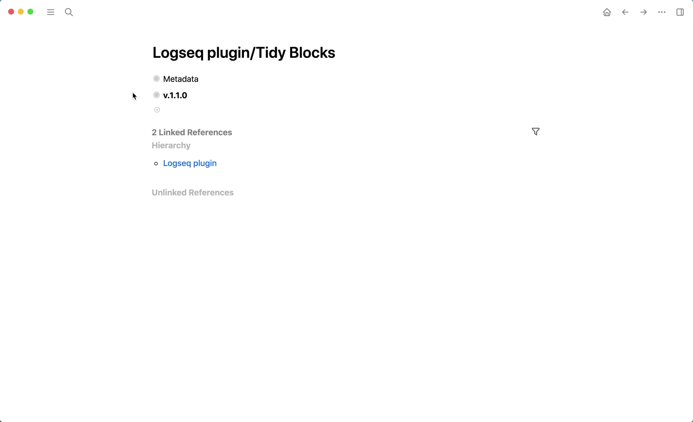
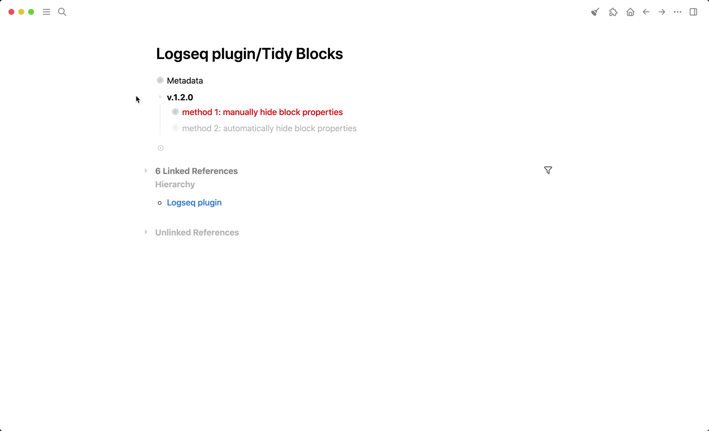
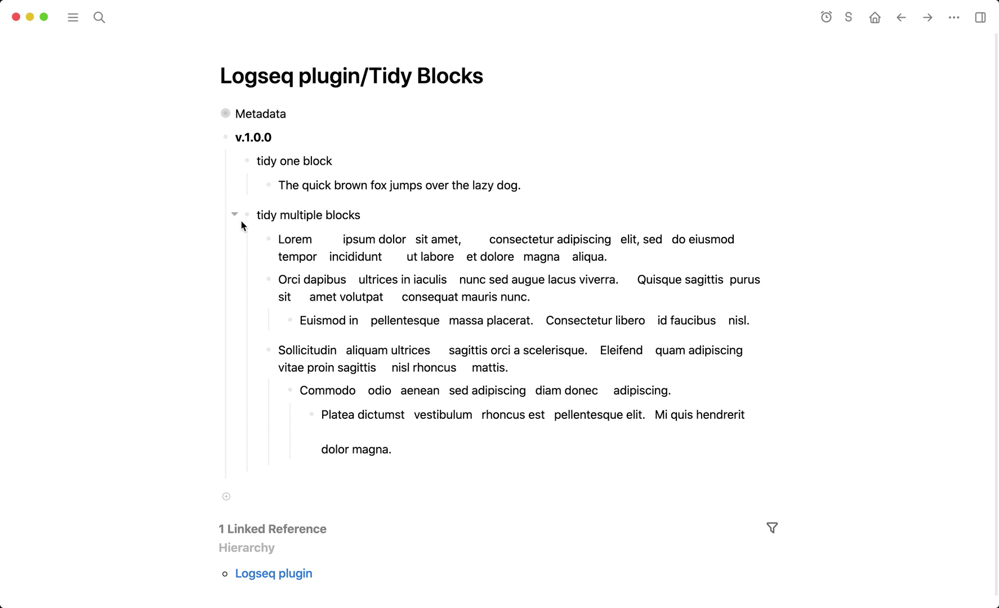
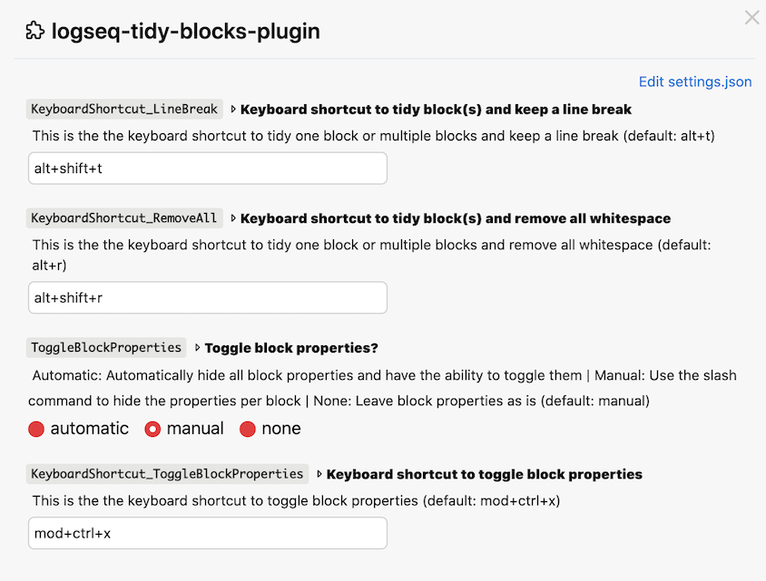

## logseq-tidy-blocks-plugin
> If you find this plugin – or any of my other [Logseq plugins](https://github.com/vyleung?tab=repositories&q=logseq&type=source) – useful and would like to support me, you can [buy me a coffee](https://www.buymeacoffee.com/vyleung) 🙂

## Features
### Remove empty blocks and whitespace from _one_ block or _multiple_ blocks in [3 ways](#3-ways-to-use-the-plugin)
#### Demo

### Toggle the display of block properties in [3 ways](#3-ways-to-use-the-plugin)
- Limitation for manually hiding block properties is that the display state of block properties is NOT remembered when Logseq is reloaded
#### Demo

### 3 ways to use the plugin
- Block context menu (right-click on bullet)
- Slash (/) command
- Keyboard shortcuts (can be configured in the [settings](#settings))
    - Usage for one block: Click on the block (as if to edit it) → Activate the keyboard shortcut
    - Usage for multiple blocks: Click on the first block (as if to edit it) → Select blocks above (`shift+up`) or below (`shift+down`) → Activate the keyboard
    - Demo: 

### Settings
- Each time you make changes to the plugin settings, please reload Logseq to ensure that all settings are updated  

## Installation
### Preparation
1. Click the 3 dots in the righthand corner → `Settings` → `Advanced` → Enable `Developer mode` and `Plug-in system`
2. Click the 3 dots in the righthand corner → `Plugins` – OR – Use keyboard shortcut `Esc t p`

### Load plugin via the marketplace (recommended)
1. Click the 3 dots in the righthand corner → `Plugins` – OR – Use keyboard shortcut `Esc t p`
2. Go to the `Marketplace` tab and search for `Tidy Blocks` → Click `Install`

### Load plugin manually
1. Download the [latest release](https://github.com/vyleung/logseq-tidy-blocks-plugin/releases) of the plugin (e.g logseq-tidy-blocks-plugin-v.1.0.0.zip) from Github
2. Unzip the file
3. Navigate to plugins (Click the 3 dots → `Plugins` – OR – Use keyboard shortcut `Esc t p`) → `Load unpacked plugin` → Select the folder of the unzipped file

## License
MIT

## Credits
- Plugin Marketplace Icon: <a href="https://www.flaticon.com/free-icons/tidy" title="tidy icons">Tidy icons created by Freepik - Flaticon</a>
- Plugin Toolbar Icon: [Material Design Icons](https://materialdesignicons.com/)
- Plugin nspired by the [Obsidian Text Format plugin](https://github.com/Benature/obsidian-text-format)
